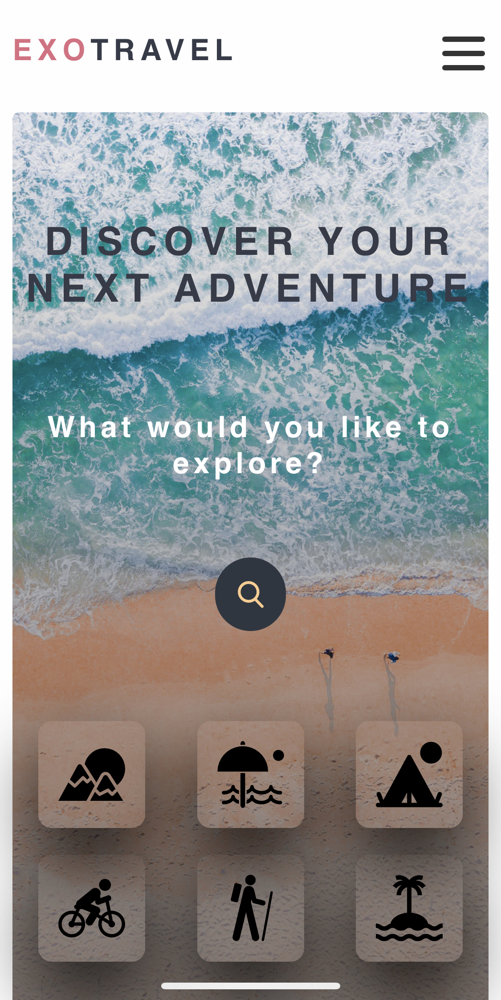

## What is this

🍳 A simple to use mobile-first React application delivering images of places you probably never heard of using the Unsplash public API. You can discover destinations by browsing from a list of suggestions, or with your own search. The app allows you to save these images to your “favorites” with a double tap, along with their locations , at which point you can revisit later and add some thoughts or view them in a map.

### How to start!

🚀 Runs the app in the development mode. That's `npm start`.

Anyway, open [http://localhost:3000](http://localhost:3000) to view it in your browser, and discover your next adventure! 🌎

#### Technologies I used

 
    
   
   
    

### Observations

 _Room for improvement_

- Some of the components can be modularized more and make them more "dumb" to become more reusable.
- Unit testing in order to make the codebase less prone to errors when refactoring.

 _Looking to the future_

- Backend integration! Perhaps using a serverless technology.
- Alternatively, implement a backend GrapQL API.

